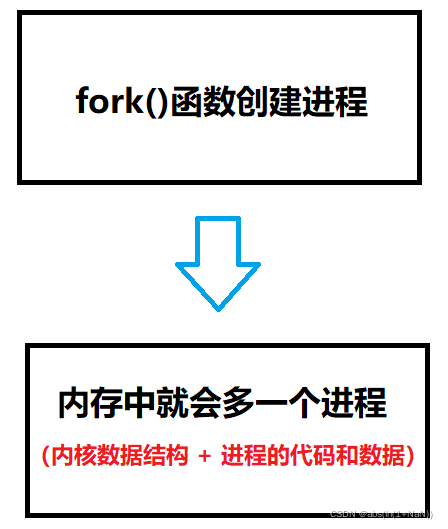
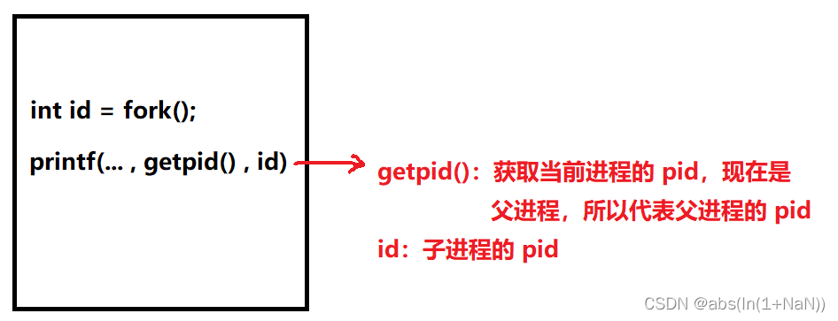
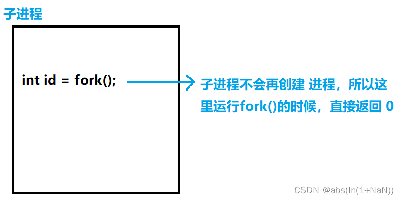
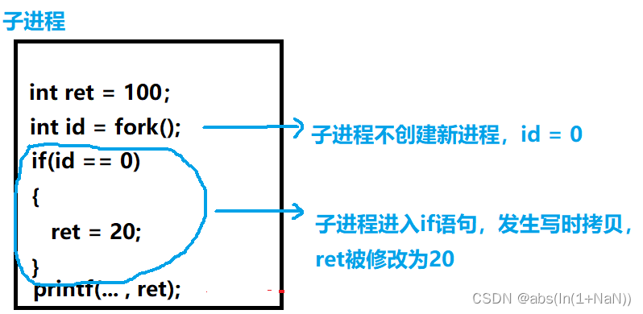

**转载至**：https://blog.csdn.net/challenglistic/article/details/123781480
# fork() 创建子进程
## 一、子进程创建代码实现
### 1、fork()函数
fork 函数的作用是创建一个子进程，函数声明如下：
```cpp
NAME 
  fork - create a child process
SYNOPSIS
  #include <unistd.h>

  pid_t fork(void);
```
这里提一下返回值，父进程创建成功会返回子进程的PID，创建失败返回 -1，创建出子进程以后，子进程也会执行fork，但是子进程不会继续创建新的进程，因此返回值是0。这是我们辨别父子进程的关键依据。

子进程运行 fork()函数 返回0
父进程运行 fork()函数 返回子进程的PID

### 2、使用fork()函数创建子进程
函数的具体使用如下， getpid()  可以获取当前进程的PID，返回值是int类型
```cpp
#include <unistd.h>
#include <cstdio>

int main() {
    int id = fork();
    printf("hello pro: %d, ret: %d\n", getpid(), id);
    sleep(1);
    return 0;
}
```
测试结果如下，我们会发现，printf函数执行了2次，而且打印的内容都不一样，这是因为子进程在被创建出来以后，会继承父进程的一部分代码 (fork函数之后的代码) ，正因为如此，这段代码既会被父进程运行，还被子进程运行

```
hello pro: 44765, ret: 44774
hello pro: 44774, ret: 0
```

## 二、子进程的创建过程
### 1、创建子进程

<br/>

之前说到，在当前阶段， 进程 = 进程控制块(task_struct) + 进程的代码和数据

```
进程控制块（task_struct）：子进程的task_struct会以父进程的为“模板”，来初始化子进程的task_struct

进程的代码和数据：默认情况下继承 “父进程” 的代码和数据（实际上是共享）。假设父进程里有个数据 a = 100，那么父、子进程会指向同一空间。
```

<br/>

```
问：父子进程虽然共享一份代码和数据，但是子进程要修改数据该怎么办？？
```

### 2、运行子进程
现在子进程也有了，接下来需要做的就是让子进程干活了！

上面说到，父子进程共享一份代码和数据，也就是说下面的代码，父、子进程都会运行。（父进程从main函数第一行开始执行，子进程从 fork 函数后面开始执行。）
```cpp
#include <unistd.h>
#include <cstdio>

int main() {
    int id = fork();
    printf("hello pro: %d, ret: %d\n", getpid(), id);
    sleep(1);
    return 0;
}
```

(1) 父进程
<br/>
<br/>

 所以结果的第一行会打印  父进程的pid 和 子进程的 pid
```
hello pro: 44765, ret: 44774
```

(2) 子进程
<br/>
<br/>

打印的顺序不一定是先打印父进程，然后打印子进程，顺序是随机的，子进程被创建以后，会立马加入到运行队列中，谁先运行完，就先打印

```
hello pro: 44774, ret: 0
```

## 三、让父子进程执行不同的任务
创建子进程，难道就是执行和父进程一样的代码？？ 肯定不是这样，我们要给子进程分配独有的任务，我们在之前代码的基础上作出修改

### 1、判断父子进程的依据
父、子进程运行同一份代码，那我们要怎么让子进程做 独有的任务？？

父进程 **运行fork函数的返回值** 是 **子进程的pid**

子进程 **运行fork函数的返回值** 是 **0**

**所以我们只需要把 子进程执行的任务放在 if语句中**

```cpp
//id为0代表子进程
if(id == 0)
{
    //子进程的任务
}
```

### 2、分配任务
首先，最开始声明一个变量 ret，初始化为100

其次，在子进程修改 ret 的值，改为 20

最后，打印输出结果

```cpp
#include <unistd.h>
#include <cstdio>

int main() {
    int ret = 100;
    int id = fork();
    if (id == 0) {
        ret = 20;
    }
    sleep(1);
    printf("ret 的值为: %d\n", ret);
    return 0;
}
```

我们先看看结果如何？？

```
ret 的值为: 20
ret 的值为: 100
```

我们发现，两次打印的值居然不一样，不是说父子进程共享一份数据和代码吗？？

答案是发生了**写时拷贝！！**

### 3、写时拷贝
进程之间是相互独立，互不影响的！！

当子进程要修改父进程的数据时，OS会另外开辟一块空间给子进程

<br/>

所谓写时拷贝，就是在写（修改）数据的时候，把数据另外拷贝一份。
这样的话，子进程修改的数据就不会影响到父进程了。

```
问：为什么不在一开始就开辟空间？？
答：如果这份代码无需修改数据，一开始就开辟会浪费很多空间
```

了解了写时拷贝，我们继续分析代码。
我们依然按照之前的分析方法分析，先分析父进程，然后分析子进程。

### 4、代码分析
(1) 父进程

<br/>

所以结果为：
```
ret 的值为: 100
```

(2) 子进程

<br/>

所以结果为：
```
ret 的值为: 20
```