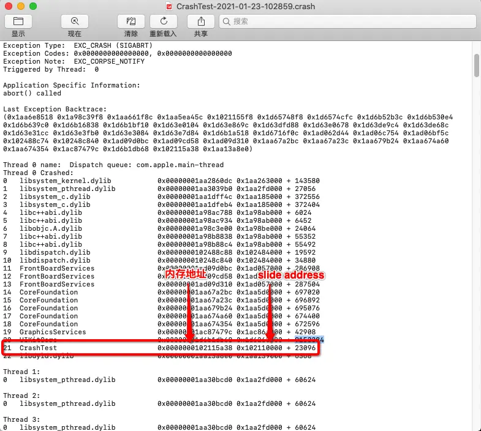
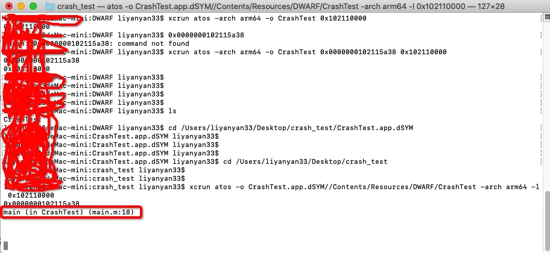

### 一、dSYM文件
dSYM 是保存十六进制函数地址映射信息的中转文件，我们调试的 symbols 都会包含在这个文件中，每次编译项目的时候都会生成一个新的 dSYM 文件，我们应该保存每个正式发布版本的 dSYM 文件，以备我们更好的定位问题，一般是在我们 release打包Archives 时保会存对应的版本文件，里面也有对应的.dSYM 和 .app 文件。

dSYM 文件在 debug 模式下默认是不生成的，我们需配置 Build Settings -> Debug Information Format下，将 DWARF 修改为 DWARF with dSYM File，再重新编译下就能生成 .dSYM文件。

#### 二、使用命令行工具atos分析crash
1. 获取ips文件：
  进入iphone设置界面 -> 隐私与安全性 -> 分析与改进 -> 分析数据 -> 找到应用的ips文件，该文件记录下应用的crash信息，导出到mac电脑中。

2. 查看crash对应的内存地址：

3. 终端 cd到dSYM所在文件 执行下面的命令：xcrun atos -o CrashTest.app.dSYM/Contents/Resources/DWARF/CrashTest -arch arm64 -l 0x102110000(内存地址)

4. 回车后 再输入slide adress 最终看到的结果是:

5. 注意arm64是dSYM文件架构 可能是armv7要根据dSYM文件的实际架构填写，否则会报错如下：atos cannot load symbols for the file CrashTest for architecture armv7

#### 三、使用dSYMTools工具
https://github.com/answer-huang/dSYMTools