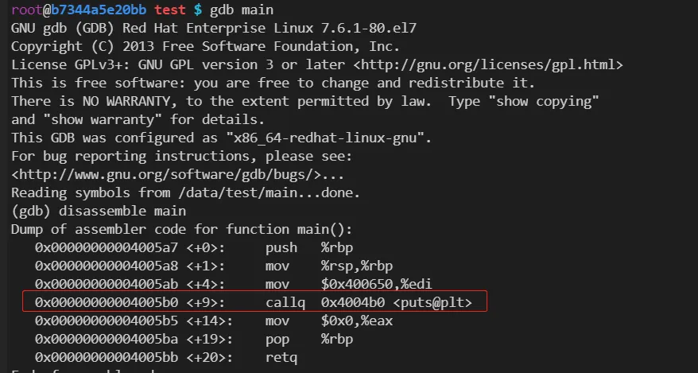
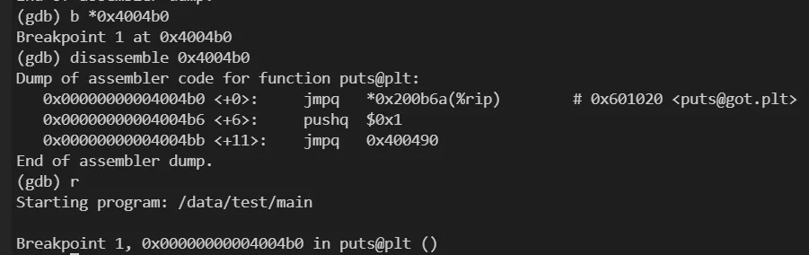
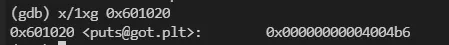
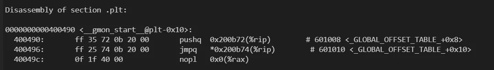
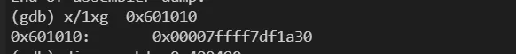
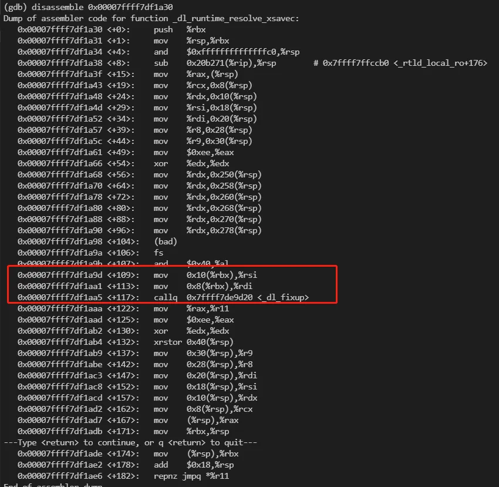
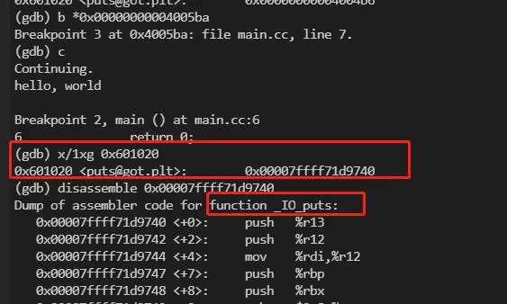

# 使用 GDB 分析 C++ 动态符号解析执行过程

在动态链接时，动态链接库的代码和数据不会被复制到可执行文件中，而是在程序加载的时候进行复制，并做动态链接，使得原来的可执行文件能够对其中定义的符号正常引用。而为了减少程序启动时的开销，C++ 动态链接库使用了懒加载的方式，本文基于GDB调试简单分析了一下这个懒加载的过程，即C++动态链接库符号的动态解析的过程。

## 1. 基础知识

### 1.1 可执行文件相关：
1. ELF文件：ELF 全称 “Executable and Linkable Format”，即可执行可链接文件格式，目前常见的Linux可执行文件、共享库（.so）、目标文件（ .o）均为此格式。
2. objdump： 对包含机器指令的段进行反汇编的。反汇编是将二进制代码转换为汇编语言的过程，可以帮助分析和理解目标文件或可执行文件的功能和结构。
3. .plt（过程链接表）：存储了跳转到外部函数的指令，每个指令对应一个.got.plt表项。第一次调用外部函数时，会通过.plt跳转到动态链接器的解析函数，解析出外部函数的真实地址，并填充到.got.plt表中。之后再调用外部函数时，就直接跳转到.got.plt表中的地址。
4. .got.plt（过程链接表的全局偏移表）：存储了外部函数的地址，每个函数对应一个.got.plt表项。与.plt表相对应，.plt表中的指令会跳转到.got.plt表中的地址。在程序加载时，.got.plt表中的地址会被初始化为.plt表中的解析函数地址，在第一次调用外部函数时，会被替换为真实的函数地址。

### 1.2 gdb相关：
1. disassemble xxx(函数名)/yyy(内存地址)： 这条命令作用是输出xxx/yyy的反汇编代码。
2. r： run的简写，作用是运行需要调试的程序。
3. x : examine的简写，用法为：x/nfu addr，作用是查看内存地址为addr里存放的值。其中，n表示列举出从addr开始的n个单位的内容；f表示输出格式(比如x表示将结果显示成十六进制)。u表示单位(w表示四字节，g表示八字节)。
4. b：break的简写，作用是设置断点。b后面需要接“函数名”或者“文件+行号”。如果只能看到地址，可以直接使用b *addr，根据运行时的地址设置断点。
5. c: continue的简写，一般用于从断点处继续执行。

## 2. 准备工作
在调试之前，我们先看下测试代码和ELF中的got表和plt表信息，便于在后续的调试过程中查看。

### 2.1 测试代码
```c
#include <stdio.h>
int main()
{
	printf("hello, world\n");
	return 0;
}
```

### 2.2 plt表
```sh
root@b7344a5e20bb test $ g++ -g main.cc -o main
root@b7344a5e20bb test $ objdump -d -j .plt main

main:     file format elf64-x86-64

Disassembly of section .plt:

0000000000400490 <__gmon_start__@plt-0x10>:
  400490:       ff 35 72 0b 20 00       pushq  0x200b72(%rip)        # 601008 <_GLOBAL_OFFSET_TABLE_+0x8>
  400496:       ff 25 74 0b 20 00       jmpq   *0x200b74(%rip)        # 601010 <_GLOBAL_OFFSET_TABLE_+0x10>
  40049c:       0f 1f 40 00             nopl   0x0(%rax)

00000000004004a0 <__gmon_start__@plt>:
  4004a0:       ff 25 72 0b 20 00       jmpq   *0x200b72(%rip)        # 601018 <_GLOBAL_OFFSET_TABLE_+0x18>
  4004a6:       68 00 00 00 00          pushq  $0x0
  4004ab:       e9 e0 ff ff ff          jmpq   400490 <_init+0x20>

00000000004004b0 <puts@plt>:
  4004b0:       ff 25 6a 0b 20 00       jmpq   *0x200b6a(%rip)        # 601020 <_GLOBAL_OFFSET_TABLE_+0x20>
  4004b6:       68 01 00 00 00          pushq  $0x1
  4004bb:       e9 d0 ff ff ff          jmpq   400490 <_init+0x20>

00000000004004c0 <__libc_start_main@plt>:
  4004c0:       ff 25 62 0b 20 00       jmpq   *0x200b62(%rip)        # 601028 <_GLOBAL_OFFSET_TABLE_+0x28>
  4004c6:       68 02 00 00 00          pushq  $0x2
  4004cb:       e9 c0 ff ff ff          jmpq   400490 <_init+0x20>
```

### 2.3 got表
```sh
root@b7344a5e20bb test $ objdump -R -j .got main

main:     file format elf64-x86-64

DYNAMIC RELOCATION RECORDS
OFFSET           TYPE              VALUE 
0000000000600ff8 R_X86_64_GLOB_DAT  __gmon_start__
0000000000601018 R_X86_64_JUMP_SLOT  __gmon_start__
0000000000601020 R_X86_64_JUMP_SLOT  puts
0000000000601028 R_X86_64_JUMP_SLOT  __libc_start_main
```

## 3. 调试过程
### 3.1 进入调试
首先，进入gdb调试模式，

<br/>

### 3.2 查看plt表中的指令
反汇编main函数，可以发现执行print函数实际上会执行0x4004b0处的指令（通过2.2节看，实际上是plt表的第三项，即plt[2]），我们在此处设置断点，然后继续执行，

<br/>

### 3.3 查看外部函数执行前，got表中存放的指令地址
可以看到0x4004b0的代码实际上包含三个步骤，执行跳转执行got[2]处的指令，压栈1，跳转执行0x400490 （即plt[0]）。我们首先看下0x601020指向的值为0x4004b6,也就是0x4004b0的下一条命令，

<br/>

继续执行，会压栈0x1，然后跳转到0x400490（即plt[0]）处执行，0x400490的汇编代码如下：

<br/>

### 3.4 动态解析过程
首先会执行一次压栈操作，然后从0x601010 处读取8字节数据作为跳转地址执行，打印一下实际的跳转地址和相应的汇编代码，

<br/>

<br/>

这段代码比较长，实现比较复杂，_dl_runtime_resolve_xsavec的功能主要是获取外部库函数的真实地址，并填充到got表中，传递的$rsi和$rdi表示got表的地址和相应函数在表中的偏移。为了验证这个过程，在main函数末尾打个断点，继续执行，

### 3.5 解析完成后got表中存放的指令地址

<br/>

执行完后发现0x601010 处的值已经变成了 0x00007ffff71d9740 也就是print函数的实际位置，后续的代码就会直接执行print函数而不会再次解析。

## 4. 总结
为了实现“动态”的效果，可执行文件访问外部库函数实际上会通过plt这个跳板代码访问，整个过程采用懒加载的方式，第一次执行时，plt代码从got表的指令实际是执行下一行命令（类似于一个查缓存的操作，如果缓存不存在，就继续往下执行写缓存），后续的代码会解析外部库函数的实际地址，然后填充到got表中，这样外部函数地址便有了一个缓存，后续再执行时，plt就会直接获取外部函数库的地址进行跳转，不用再次解析。